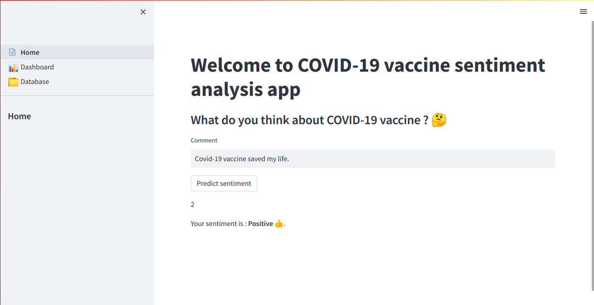

# End-to-end sentiment analysis Application (from scrapping to App deployment)

## Context : 
As a data scientist, my favorite tasks were machine learning/deep learning models creation and training and data analysis and vizualisations. After my first professional experience, I realised that training models locally is not meaningful in the real-world. Indeed, in order to resolve business problems with machine learning models, we have to deploy them into production.  

I decided to get more skills in machine learning engineering and data engineering related tasks through personnal projects. This project's finality is a web application that mainly predict the sentiment (NEGATIVE-NEUTRAL-POSITIVE) in an input sentence of the user.

*Future functionalities : On the dashboard page, you can see the performances of the model. On the Database page, you can explore the test dataset and interact with it.* 

The projet consists of multiple steps:
- Data collection and engineering
- Model training 
- Model serving through APi 
- Web Application creation
- App containerization
- App deployment on the cloud 
- *Next : Database connection*

**1. Data collection and engineering with (Twint, Rubrix, Pandas)**

**2. Model training (Bert)** 

**3. Model serving through APi (FastApi)**

**4. Web Application creation (Streamlit)**

**5. App containerization (Docker , Docker-compose)**

**6. App deployment on the cloud (AWS EC2)**